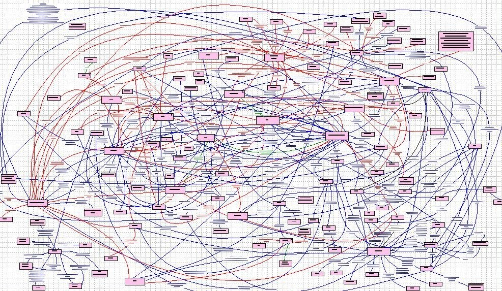
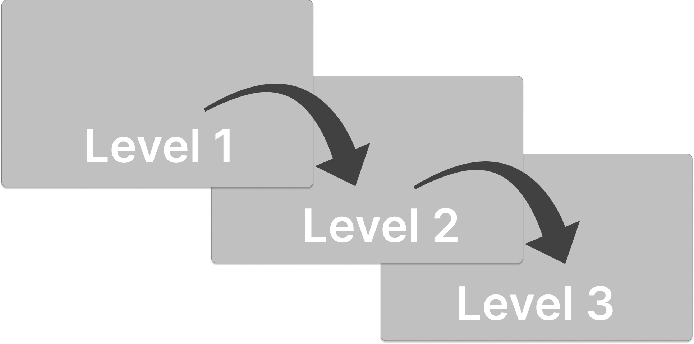
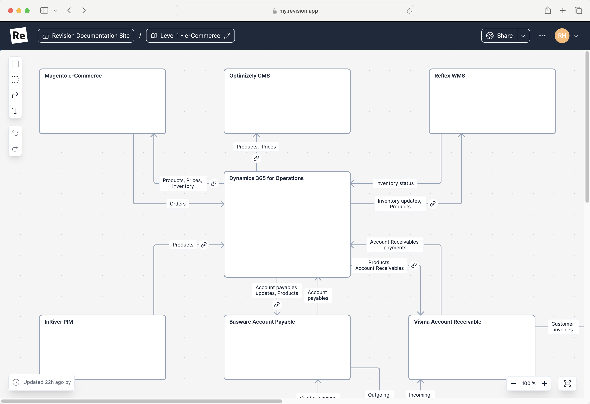
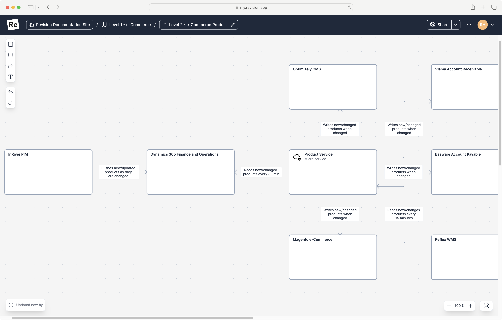
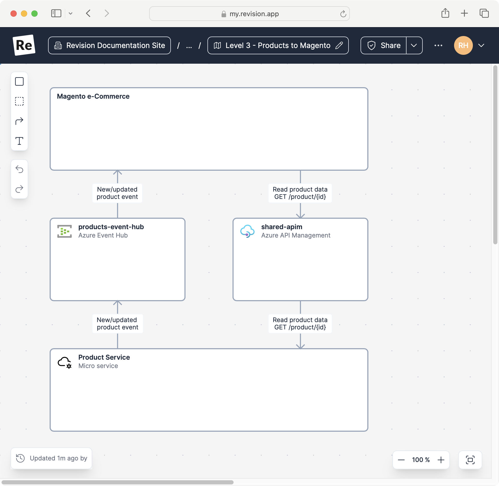

One could argue that creating good documentation for an integration solution is harder than with other types of software projects. The reason is that integration solutions almost always span over many systems and services and that we often talk about _hundreds_ of integrations, touching almost every part of your architecture.

Keeping track of such a complex system is literally _impossible_ without the right documentation. 🤯

<figure>
  
  <figcaption>An example of bad documentation ...</figcaption>
</figure>

## Basic principles of good documentation for an integration architecture

### 1. Visualizations and diagrams are more important than textual documentation.

Textual documentation has its place and is important. But when it comes to trying to describe complex scenarios, visualizations in the form of architectural diagrams are easier to quickly understand and therefore arguably the most important part of your documentation.

### 2. Focus on the high-level diagrams.

As developers, we're good at documenting all the little technical details in our solutions. But we often document things we end up looking up in the live code and configurations. Focus on high-level documentation, the overall picture, and how the different parts of your solutions relate to each other.

### 3. Make it readable for everyone.

UML and complex notations are great - if you understand them fully. The [C4 model](https://c4model.com) formalized the idea of a much simpler notation, based on boxes and arrows - easier to understand and work with.

Use a dead simple notation that everybody can write and read.

### 4. Make it useful for everyone.

Besides a simple notation, the [C4 model](https://c4model.com) describes a few different diagrams with increasing levels of detail. Using different levels makes it possible to drill down from an overview into more detailed diagrams. Similar to zooming in and out of a digital map.

> Utilizing the levels and the simple notation in the C4 model, diagrams can have information useful for non-technical business users and describe large parts of architecture, without cluttering them down with too many details.

## The C4 levels in an integration context

Let's look at the three levels that make up good integration documentation.

<figure >
  
  <figcaption>C4 model diagrams levels with increasing detail.</figcaption>
</figure>

### Level 1 (Context) - The Overall picture

For quickly understanding an integration architecture the most important part of documentation is the high-level documentation. It shows all the systems and the data-flows between them. Not the nitty-gritty details, just what systems are involved and what data is transferred between them.

In smaller architectures, it's possible to describe all systems and data-flows in a single level 1 diagram. In large ones, we need to choose a context to avoid too large and hard-to-read diagrams. In this example, the context is the `e-Commerce` part of the architecture.

<figure>
  
  <figcaption>Level 1, Overall picture example - <a href="https://my.revision.app/diagram/6idZKQTeD8C9">https://my.revision.app/diagram/6idZKQTeD8C9</a>.</figcaption>
</figure>

It's important to keep these diagrams as simple as possible. It's often tempting to include more details than necessary. Try to skip everything besides concrete systems and what type of data that's transferred. The reason for this is that these diagrams otherwise get too complicated, hard to work with and hard to understand.

This part of the documentation is _important_. This is information that often is hard to understand by looking at the code and configuration.

This is also the part of the documentation that business users will understand. As we all know, getting the business users involved is critical for making the right decisions and in the end creating solutions that actually help the business in the right way.

Even though most people would agree that the overall picture is important to have documented, I've found that this is the part most developers tend to skip.

### Level 2 (Container) - The Integration Processes

It's hard to define an integration. In the overall picture product data are moved between several systems. Is the integration the part that moves the products between `InRiver PIM` and `Dynamics 365 PO`? Or is the integration the overall process that makes sure the products end up in all the destination systems?

Leaving that discussion aside we can agree that the purpose of an integration is to support some sort of business process. In this case, the handling of product master data.

Documenting how we support a business process is the second level of diagrams.

The difference between this and the level 1 diagram is that we'll zoom in to a specific area and that we'll here include more details - things that we didn't want to include in the overall picture to keep it easy to understand. In the example, we're showing that product master data actually is distributed using a product service. We're also including other details we didn't show in the level 1 diagram.

<figure>
  
  <figcaption>Level 2, Integration Process example - <a href="https://my.revision.app/diagram/bwoG8AXEhhxD">https://my.revision.app/diagram/bwoG8AXEhhxD</a>. Shows how product master data flows between systems. </figcaption>
</figure>

Again this is information that is hard to get from reading code and configuration and that is important for getting the business users to understand what we're actually building.

It's important to try and keep purely technical details out of this diagram and try and focus on more business rules like information. Information that is useful for a business user.

Example of information we might include on level 2;

- what's triggering the transfer
- duplication checks
- conversions
- transformations of data, and so on

### Level 3 - The Integration Details

This is probably the diagram that needs the least explanation. This is the part I often find well-documented and maintained. Here we document all the technical components and implementation details.

This is however also the part that doesn't always require that much documentation. Much of the details at this level can easily be found in code and configuration and it's easy to spend time documenting things that in the end developers will look up code and configuration instead. 

<figure>
  
  <figcaption>Level 3, Integration Details example - <a href="https://my.revision.app/diagram/RmXsxDtuAEHy">https://my.revision.app/diagram/RmXsxDtuAEHy</a>. Shows a detailed view of how product master data in moved between one system to another.</figcaption>
</figure>

## The Revision diagramming tool

The example diagrams in this post is created using [Revision](https://revision.app). A tool specialized to make sure your dev teams avoid wasting time on documentation no one reads.
